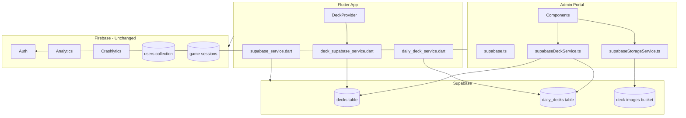

# Supabase Implementation for Deck Storage

## Architecture Overview



---

## Phase 1: Supabase Project Setup

### 1.1 Create Supabase Project

1. Go to [supabase.com](https://supabase.com) and create a new project
2. Note the **Project URL** and **anon public key** from Settings > API
3. Create the database schema and storage bucket (see 1.2 and 1.3)

### 1.2 Database Schema

Create file: `admin-portal/scripts/supabase-schema.sql`

The SQL will create:

- `decks` table with all fields from current Firestore structure
- `daily_decks` table for daily challenges
- Row Level Security policies for public read access
- Indexes for `countries`, `is_active`, `priority`
- Auto-update trigger for `updated_at`

Key columns for `decks`:

- `id` (UUID primary key)
- `name`, `description`, `cards` (TEXT[])
- `icon_code_point`, `icon_font_family`, `color_value`
- `image_url`, `is_premium`, `is_active`
- `country`, `countries` (TEXT[]), `tags` (TEXT[])
- `priority`, `play_count`, `has_difficulty_modes`
- `cards_by_difficulty` (JSONB), `research` (JSONB)
- `created_at`, `updated_at` (TIMESTAMPTZ)

### 1.3 Storage Bucket

Create `deck-images` public bucket via Supabase Dashboard:

- Storage > New bucket > Name: "deck-images" > Make public

---

## Phase 2: Admin Portal Changes

### 2.1 Configuration Files

| File | Action |

|------|--------|

| [admin-portal/package.json](admin-portal/package.json) | Add `@supabase/supabase-js` dependency |

| `admin-portal/src/config/supabase.ts` | **CREATE** - Supabase client initialization |

| `admin-portal/.env.local.example` | **CREATE** - Document required env variables |

Environment variables needed:

```
VITE_SUPABASE_URL=https://your-project.supabase.co
VITE_SUPABASE_ANON_KEY=your-anon-key
```

### 2.2 New Services

| File | Purpose |

|------|---------|

| `admin-portal/src/services/supabaseDeckService.ts` | **CREATE** - Deck CRUD operations using Supabase |

| `admin-portal/src/services/supabaseStorageService.ts` | **CREATE** - Image upload to Supabase Storage |

**supabaseDeckService.ts** will implement:

- `getAllDecks()` - Fetch all decks with real-time option
- `createDeck(data)` - Insert new deck
- `updateDeck(id, data)` - Update existing deck
- `deleteDeck(id)` - Delete deck
- `subscribeToDecks(callback)` - Real-time subscription
- `getCountryDistribution()` - Count decks by country
- Daily deck operations (CRUD + subscribe)

**supabaseStorageService.ts** will implement:

- `uploadDeckImage(file, deckId, onProgress)` - Upload with compression
- `deleteDeckImage(imageUrl)` - Remove image
- `getPublicUrl(path)` - Get public URL

### 2.3 Component Updates

| File | Changes Required |

|------|------------------|

| [admin-portal/src/components/DeckList.tsx](admin-portal/src/components/DeckList.tsx) | Replace `onSnapshot(collection(db, 'decks'))` with Supabase subscription; Replace `deleteDoc` with Supabase delete |

| [admin-portal/src/components/DeckForm.tsx](admin-portal/src/components/DeckForm.tsx) | Replace `addDoc`/`updateDoc` with Supabase service; Update image upload to use Supabase Storage |

| [admin-portal/src/components/AIDeckGenerator.tsx](admin-portal/src/components/AIDeckGenerator.tsx) | Replace `addDoc(collection(db, 'decks'))` with Supabase insert |

| [admin-portal/src/components/DailyDeckManager.tsx](admin-portal/src/components/DailyDeckManager.tsx) | Replace all Firestore operations with Supabase |

### 2.4 Service Updates

| File | Changes Required |

|------|------------------|

| [admin-portal/src/services/automationService.ts](admin-portal/src/services/automationService.ts) | Replace Firestore deck operations with Supabase service calls |

| [admin-portal/src/services/imageCompressionService.ts](admin-portal/src/services/imageCompressionService.ts) | Replace Firebase Storage upload with Supabase Storage |

---

## Phase 3: Flutter App Changes

### 3.1 Dependencies

| File | Changes |

|------|---------|

| [pubspec.yaml](pubspec.yaml) | Add `supabase_flutter: ^2.8.0` (keep all Firebase packages) |

### 3.2 New Services

| File | Purpose |

|------|---------|

| `lib/services/supabase_service.dart` | **CREATE** - Supabase client initialization (singleton pattern) |

| `lib/services/deck_supabase_service.dart` | **CREATE** - Deck operations using Supabase |

**supabase_service.dart** will:

- Initialize Supabase client with URL and anon key
- Provide singleton access like `FirebaseService`
- Be called in `main.dart` during background initialization

**deck_supabase_service.dart** will mirror [lib/services/deck_firebase_service.dart](lib/services/deck_firebase_service.dart):

- `getDefaultDecks()`, `getDecksByCountry()`, `getDecksByCountries()`
- `refreshDecksByCountry()`, `searchDecksGlobally()`
- `streamDecksByCountry()` - Using Supabase Realtime
- `incrementDeckPlayCount()` - Update play count
- Custom deck operations remain local (unchanged)

### 3.3 Model Updates

| File | Changes |

|------|---------|

| [lib/models/deck.dart](lib/models/deck.dart) | Add `Deck.fromSupabase(Map<String, dynamic>)` factory and `toSupabase()` method |

| [lib/models/daily_deck.dart](lib/models/daily_deck.dart) | Add `DailyDeck.fromSupabase(Map<String, dynamic>)` factory |

Key mapping (Supabase snake_case to Dart camelCase):

- `icon_code_point` -> `iconCodePoint`
- `color_value` -> `colorValue`
- `image_url` -> `imageUrl`
- `is_premium` -> `isPremium`
- `cards_by_difficulty` -> `cardsByDifficulty`

### 3.4 Service Updates

| File | Changes |

|------|---------|

| [lib/services/daily_deck_service.dart](lib/services/daily_deck_service.dart) | Replace Firestore queries with Supabase queries |

| [lib/services/cache_service.dart](lib/services/cache_service.dart) | No changes needed - works with Deck model |

### 3.5 Provider Updates

| File | Changes |

|------|---------|

| [lib/providers/deck_provider.dart](lib/providers/deck_provider.dart) | Replace `DeckFirebaseService` with `DeckSupabaseService` |

### 3.6 Main App Updates

| File | Changes |

|------|---------|

| [lib/main.dart](lib/main.dart) | Add `SupabaseService().initialize()` in `_initializeServicesInBackground()` |

---

## Phase 4: Data Migration

### 4.1 Migration Script

Create file: `admin-portal/scripts/migrate-to-supabase.ts`

The script will:

1. Connect to both Firestore and Supabase
2. Fetch all documents from `decks` collection
3. Transform camelCase to snake_case
4. Insert into Supabase `decks` table in batches
5. Repeat for `daily_decks` collection
6. Log progress and handle duplicates

Run once after Supabase tables are created.

---

## Files Summary

| Category | Files to Create | Files to Modify |

|----------|-----------------|-----------------|

| Admin Config | 3 | 1 |

| Admin Services | 2 | 2 |

| Admin Components | 0 | 4 |

| Flutter Config | 0 | 2 |

| Flutter Services | 2 | 1 |

| Flutter Models | 0 | 2 |

| Flutter Providers | 0 | 1 |

| Scripts | 2 | 0 |

| **Total** | **9** | **13** |

---

## Implementation Order

1. Create Supabase project and run schema SQL
2. Create Admin Portal config and services
3. Update Admin Portal components one by one
4. Run migration script to copy data
5. Add Supabase to Flutter app
6. Create Flutter services and update models
7. Update DeckProvider to use new service
8. Test both apps end-to-end